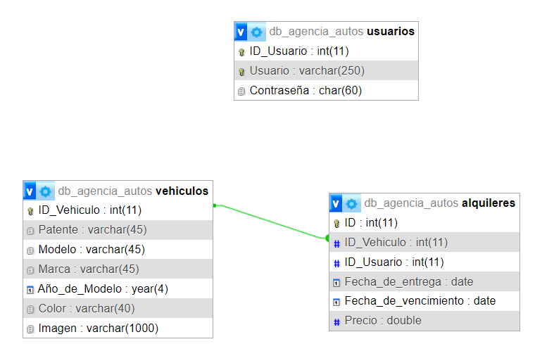

# Agencia de autos

## DER

## Integrantes:
- Ferrante, Tomas Abel (44048410)
- Denot, Mayra Andrea (45539846)

## Descripción
Sistema para gestionar alquileres de autos. La tabla alquileres tiene un ID (Foreign key) que se encuentra vinculada con el ID_Vehiculo (Primary key) de la tabla Vehiculos.

## Auto Deployment

En el model genérico generamos la conexión a la base de datos y a través de un método _deploy(), se ejecuta una consulta para traer todas las tablas de la base. Si no encuentra ninguna tabla, ejecuta una sentencia SQL que las crea.

## Permisos de administrador
Para poder modificar los items y categorías debe iniciar sesión con los siguientes datos:

**Usuario**: webadmin  
**Constraseña**: admin
